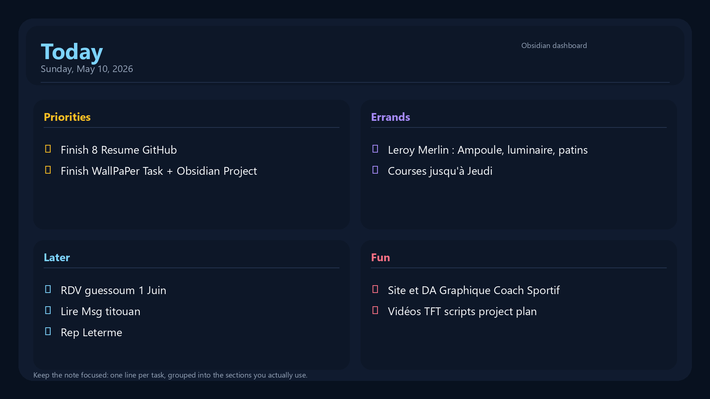
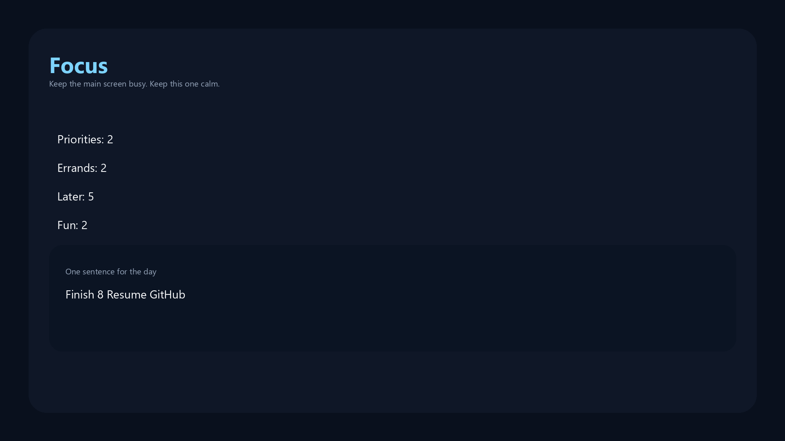
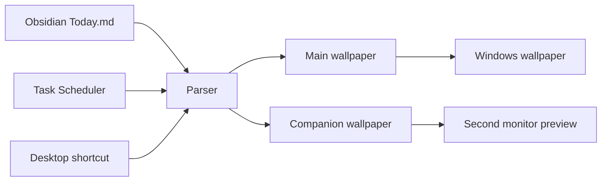

# Daily Wallpaper Tasks

Obsidian-powered Windows wallpapers for task planning. The app turns your `Today.md` note into a desktop dashboard and a second calm companion wallpaper.

## Preview





If you add a GIF later, put it here. A short 5 to 10 second screen recording showing:

1. editing `Today.md`
2. running `Update Today Wallpaper.lnk`
3. the wallpaper changing on both monitors

## What It Does

- Reads tasks from `C:\Users\User\Documents\Obsidian Vault\Today.md`
- Renders each note section as a visual card
- Generates two wallpapers: a main task board and a minimal second-screen view
- Can apply the main wallpaper directly to Windows
- Supports a daily Task Scheduler job and a desktop shortcut for on-demand refresh

## How It Works



## Quick Start

```powershell
python -m src.main --set-wallpaper
```

Test only, no wallpaper change:

```powershell
python -m src.main
```

## Note Format

Use headings like these in `Today.md`:

```md
## Priorities
- [ ] First task
- [ ] Second task

## Errands
- [ ] Buy groceries

## Later
- [ ] Research one idea

## Fun
- [ ] First task
- [ ] Second task
```

The program reads every `##` or `###` section in `Today.md` and turns each section into a card on the wallpaper.

## Automation

Create the daily scheduled task:

```powershell
.\scripts\install-task.ps1
```

Remove it cleanly later:

```powershell
.\scripts\uninstall-task.ps1
```

Create or refresh the desktop shortcut:

```powershell
.\scripts\create-shortcut.ps1
```

## Configuration

- `config.json`: vault path, note name, headings, and task markers
- `src/main.py`: parsing, layout, rendering, and wallpaper setting
- `output/`: generated wallpaper images

## Troubleshooting

- If nothing renders, confirm `C:\Users\User\Documents\Obsidian Vault\Today.md` exists and uses `##` headings.
- If the wallpaper does not change, run `python -m src.main --set-wallpaper` once manually to confirm Python works.
- If Task Scheduler does not run, reinstall it with `.\scripts\install-task.ps1` and check the task name `Daily Wallpaper Tasks`.
- If the desktop shortcut does nothing, recreate it with `.\scripts\create-shortcut.ps1`.
- If you use a different vault path, update `config.json` before scheduling anything.
